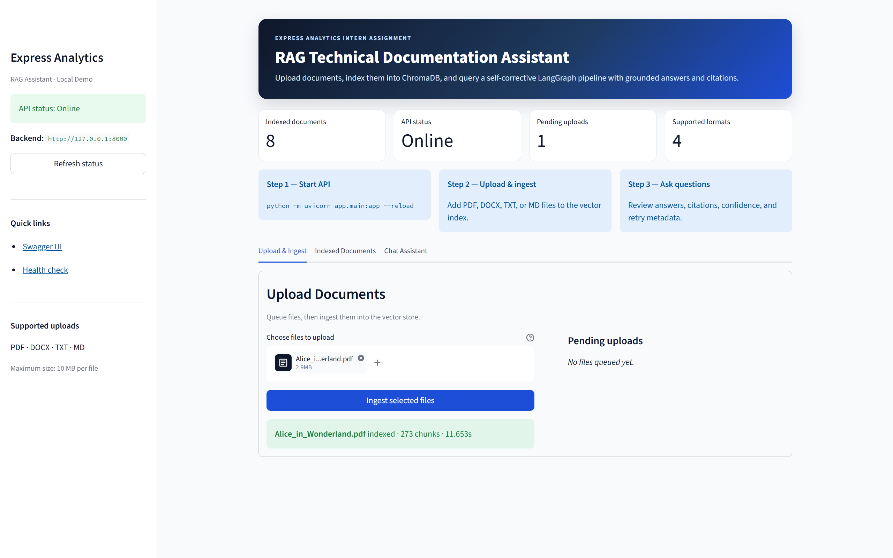
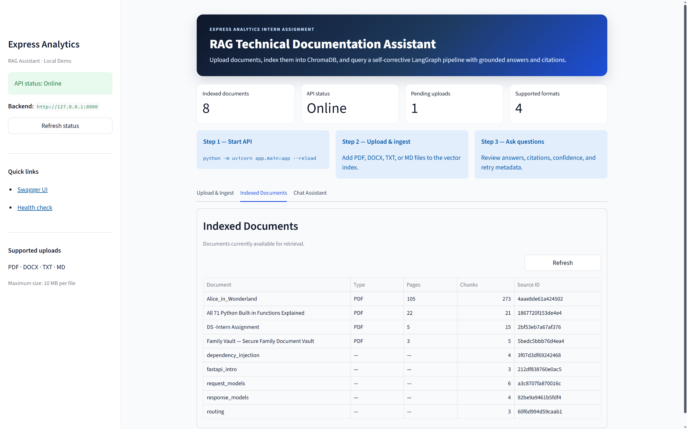
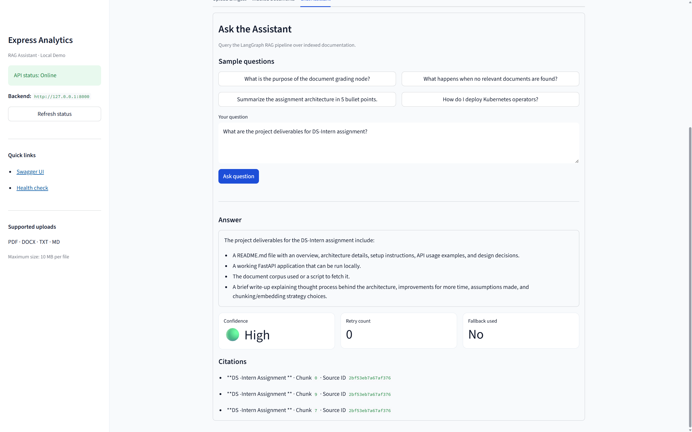

# Express Analytics RAG Assistant

A production-style RAG technical documentation assistant built for the Express Analytics AI/ML Engineer Intern assignment. The system ingests local technical documentation, indexes it in a persistent ChromaDB vector store, and answers user questions through a self-corrective LangGraph workflow exposed by FastAPI.

---

## Project Overview

This project implements a Retrieval-Augmented Generation (RAG) assistant for technical documentation. It answers questions about an indexed documentation corpus with source citations, retries when retrieval quality is poor, and returns a safe fallback response when the local corpus does not contain enough information.

The implementation demonstrates clean engineering boundaries:

- **FastAPI API layer** for `/query`, `/upload`, `/ingest`, `/documents`, `/feedback`, and `/health`
- **LangGraph workflow** for query analysis, retrieval, grading, retry, generation, and fallback
- **ChromaDB vector search** with local `sentence-transformers` embeddings
- **Ollama-backed LLM grading and generation**, with deterministic fallbacks when the LLM is unavailable
- **Typed graph state** with explicit reducer semantics for retry history
- **Incremental indexing** that preserves uploaded documents across corpus re-ingestion
- **Streamlit frontend** for local interactive testing
- **74 passing tests** in a deterministic pytest suite

---

## Features

### Core RAG pipeline

- Load Markdown, text, HTML, PDF, and Word (`.docx`) documentation
- Chunk documents with citation-ready metadata
- Build and update a persistent ChromaDB index
- Rewrite user queries for retrieval
- Grade retrieved chunks as relevant or irrelevant (LLM + heuristic fallback)
- Retry with transformed queries when no relevant context is found
- Generate grounded answers with structural citations
- Return safe low-confidence fallback answers when context is insufficient
- Store user feedback for generated answers

### Document ingestion & upload

- **PDF ingestion** via PyMuPDF (`fitz`) with page-count metadata
- **DOCX ingestion** via `python-docx` with paragraph-order preservation
- **`POST /upload`** for multipart file uploads to `data/uploads/`
- **Incremental indexing** via source-scoped replacement (uploads survive corpus re-ingest)
- **Duplicate prevention** through deterministic chunk IDs and upload filename checks

### Developer experience

- Interactive **Streamlit UI** with upload, indexed-documents table, and chat
- OpenAPI docs at `/docs`
- Comprehensive pytest coverage across graph, API, ingestion, and vector store

---

## Architecture

High-level flow:

```text
User
  |
  v
FastAPI
  |
  v
LangGraph StateGraph
  |
  v
Vector Store Service
  |
  v
ChromaDB
```

Detailed architecture:

```text
                    +----------------------+
                    |        User          |
                    +----------+-----------+
                               |
                               v
                    +----------------------+
                    |       FastAPI        |
                    | /query /upload ...   |
                    +----------+-----------+
                               |
              +----------------+----------------+
              |                                 |
              v                                 v
   +----------------------+          +----------------------+
   |   LangGraph Workflow |          |  Ingestion Pipeline  |
   | query -> retrieve -> |          | load -> chunk        |
   | grade -> generate    |          +----------+-----------+
   +----------+-----------+                     |
              |                                 v
              v                      +----------------------+
   +----------------------+          |   VectorStoreService |
   |    LLMService        |          | upsert / replace     |
   | Ollama structured    |          +----------+-----------+
   | grading/generation   |                     |
   +----------------------+                     v
                                      +----------------------+
                                      |       ChromaDB       |
                                      |  app/storage/chroma_db
                                      +----------------------+
```

Component responsibilities:

| Path | Responsibility |
|---|---|
| `app/api/` | FastAPI route modules (thin HTTP layer) |
| `app/schemas/` | Pydantic request/response contracts |
| `app/graph/` | LangGraph state, builder, routers, and nodes |
| `app/ingestion/` | Local document loading and chunking |
| `app/services/` | LLM, embedding, and vector-store boundaries |
| `app/storage/` | Persistence adapters (feedback, ChromaDB) |
| `app/core/` | Environment-driven settings |
| `frontend.py` | Streamlit UI for local testing |
| `tests/` | Deterministic pytest coverage |

---

## LangGraph Workflow

### Main workflow

```text
START
  |
  v
Query Analysis
  |
  v
Retrieval
  |
  v
Document Grading
  |
  v
Conditional Routing
  |----------------------|
  |                      |
  v                      v
Generate          Transform Query
  |                      |
  v                      v
 END                Retrieval
                         |
                         v
                    Document Grading

Fallback can be reached from conditional routing when retries are exhausted
or a graph error is recorded.
```

### Retry loop

```text
Document Grading
  |
  | no relevant docs and retry_count < max_retries
  v
Transform Query
  |
  | retry_count += 1
  | rewritten_query replaced
  | previous query appended if unique
  v
Retrieval
  |
  v
Document Grading
```

### Conditional routing after grading

```python
if len(graded_docs) > 0:
    return "generate"

if retry_count < max_retries:
    return "transform_query"

return "fallback"
```

### Self-Corrective RAG Design

#### Query Analysis

`app/graph/nodes/query_analysis.py` normalizes and rewrites the user question for retrieval. It also classifies the query as:

- `conceptual`
- `how_to`
- `troubleshooting`
- `api_reference`

Example:

```text
Question: How does FastAPI validate request bodies?
Rewrite:  How does FastAPI validate request bodies using Pydantic models?
```

#### Retrieval

`app/graph/nodes/retrieval.py` reads `rewritten_query` and delegates vector search to `VectorStoreService.similarity_search()`. It returns retrieved chunks in a normalized shape:

```json
{
  "content": "...",
  "metadata": {...},
  "score": 0.91
}
```

#### LLM Grading

`app/graph/nodes/grading.py` uses `LLMService.grade_relevance(question, chunk)` as the primary grader. The Ollama-backed service requests structured JSON:

```json
{
  "verdict": "relevant",
  "confidence": 0.88,
  "reason": "The chunk directly explains FastAPI request body validation."
}
```

#### Heuristic Fallback Grading

If Ollama is unavailable, times out, or returns malformed output, grading falls back to a deterministic heuristic. This keeps the graph usable without external API keys or a running LLM.

The heuristic uses:

- vector similarity score
- overlap count between question terms and chunk terms
- overlap ratio

It is intentionally conservative to avoid false positives. A chunk is not accepted just because it shares a generic term such as `FastAPI`.

#### Transform Query

`app/graph/nodes/transform_query.py` produces deterministic alternate queries when grading finds no relevant context. It:

- increments `retry_count`
- replaces `rewritten_query`
- appends the previous query only if it is unique
- avoids repeating prior rewrites

Example sequence:

```text
How do I configure OAuth2 scopes in FastAPI?
Give a broad overview of configure OAuth2 scopes in FastAPI and related concepts.
Documentation about: configure, OAuth2, scopes, FastAPI.
```

#### Retry Logic

Retries are bounded by `max_retries` from settings (default `2`). The graph state stores only `retry_count`, keeping runtime configuration separate from checkpointed workflow state.

#### Confidence Scoring

Confidence is deterministic:

- `low`: fallback path used
- `high`: first attempt with multiple relevant graded docs
- `medium`: thinner context or answer after retries

### Key Components

| Node | File | Responsibilities |
|---|---|---|
| Query Analysis | `app/graph/nodes/query_analysis.py` | Normalize question, classify query type, rewrite for retrieval |
| Retrieval | `app/graph/nodes/retrieval.py` | Vector search via `rewritten_query` |
| Grading | `app/graph/nodes/grading.py` | LLM grading with heuristic fallback; produce `graded_docs` |
| Transform Query | `app/graph/nodes/transform_query.py` | Unique alternate queries; increment `retry_count` |
| Generation | `app/graph/nodes/generation.py` | Ollama answer generation with extractive fallback; structural citations |
| Fallback | `app/graph/nodes/fallback.py` | Safe low-confidence response when context is insufficient |
| Hallucination Check *(bonus)* | `app/graph/nodes/hallucination_check.py` | Deterministic groundedness check (implemented, not wired into main graph) |

### Supported Document Formats

File: `app/ingestion/loaders.py`

| Extension | Format | Loader |
|---|---|---|
| `.md` | Markdown | UTF-8 text read |
| `.txt` | Plain text | UTF-8 text read |
| `.html`, `.htm` | HTML | Visible text extraction |
| `.pdf` | PDF | PyMuPDF (`fitz`) — text from all pages |
| `.docx` | Microsoft Word | `python-docx` — paragraphs in order |

Unsupported files are logged and skipped without failing the ingestion run.

All loaded documents include `source_id`, `source_title`, `source_path`, and `filename`. PDFs also include `page_count` and `file_type: "pdf"`; DOCX files include `file_type: "docx"`.

### Vector Search & Chunking

**Embedding model:** `sentence-transformers/all-MiniLM-L6-v2` (local, lazy-loaded)

**ChromaDB** (`app/services/vector_store.py`):

- `add_documents(documents)` — incremental upsert
- `replace_documents_for_sources(documents)` — source-scoped reindex
- `similarity_search(query, k=5)`
- `list_documents()` / `document_count()`

**Chunking** (`app/ingestion/chunking.py`): `RecursiveCharacterTextSplitter` with `chunk_size=800`, `chunk_overlap=100`

Each chunk preserves `source_id`, `source_title`, `source_path`, `chunk_index`, and `section_heading` for stable citations.

### Ollama Integration

File: `app/services/llm.py`

Default settings:

```text
OLLAMA_BASE_URL=http://localhost:11434
OLLAMA_MODEL=qwen2.5:14b
LLM_REQUEST_TIMEOUT_SECONDS=30
```

If Ollama is not running:

- the grading node falls back to deterministic heuristic grading
- the generation node falls back to extractive context-based answers

---

## Upload Workflow

```text
User Upload (Streamlit or POST /upload)
  |
  v
data/uploads/
  |
  v
DocumentLoader  (PDF / DOCX / TXT / MD)
  |
  v
DocumentChunker
  |
  v
EmbeddingService  (all-MiniLM-L6-v2)
  |
  v
VectorStoreService.add_documents()
  |
  v
ChromaDB  →  immediately queryable via POST /query
```

### Supported upload formats

| Format | Extension |
|---|---|
| PDF | `.pdf` |
| Word | `.docx` |
| Plain text | `.txt` |
| Markdown | `.md` |

> HTML is supported by the corpus loader but not the upload API.

### Upload constraints

| Constraint | Value |
|---|---|
| Maximum file size | **10 MB** |
| Duplicate prevention | Filename collision in `data/uploads/` returns `already_exists` |
| Metadata preserved | `source_id`, `source_title`, `source_path`, `filename`, `file_type`, `page_count` (PDF) |

Uploaded files are saved to `data/uploads/`, processed through the same loader → chunker → embedder pipeline as corpus files, and indexed incrementally without affecting other documents.

---

## Incremental Indexing

### Previous behavior

`POST /ingest` originally called `build_index()`, which deleted the entire Chroma collection and rebuilt from corpus chunks only. Any documents added via `POST /upload` were wiped on the next corpus ingest.

### Current behavior

`POST /ingest` now calls `replace_documents_for_sources()`:

1. Extract `source_id` values from the incoming corpus batch
2. Delete only existing chunks matching those `source_id`s
3. Upsert the refreshed corpus chunks

Uploaded documents (stored under `data/uploads/`) have different `source_id` hashes and **survive corpus re-ingestion**.

```text
                    +------------------+
                    |  POST /ingest    |
                    |  (data/corpus)   |
                    +--------+---------+
                             |
                             v
              replace_documents_for_sources()
                             |
              +--------------+--------------+
              |                             |
              v                             v
   Delete chunks where            Upsert new corpus
   source_id IN corpus_ids        chunks (deterministic IDs)
              |
              +--> Upload chunks (other source_ids) UNTOUCHED
```

### Deterministic `source_id` strategy

- `source_id` = first 16 hex chars of `SHA-1(resolved_source_path)`
- Corpus files: `data/corpus/request_models.md` → one `source_id`
- Uploads: `data/uploads/assignment.pdf` → a different `source_id`
- Chunk IDs: `{source_id}:{chunk_index}:{content_hash}` — upserts prevent duplicate chunks on re-index

---

## API Documentation

Base URL: `http://localhost:8000`

Interactive docs: `http://localhost:8000/docs`

### GET /health

Returns application liveness.

**Response:**

```json
{
  "status": "healthy"
}
```

---

### POST /query

Runs the compiled LangGraph workflow.

**Request:**

```json
{
  "question": "How does FastAPI validate request bodies?"
}
```

**Response:**

```json
{
  "query_id": "b5ef82bf-74a6-4b5d-8bdc-7d6b888748e2",
  "answer": "FastAPI validates request bodies using Pydantic models.",
  "citations": [
    {
      "source_id": "a3c8707fa870016c",
      "source_title": "request_models",
      "chunk_index": 0
    }
  ],
  "confidence": "high",
  "retry_count": 0,
  "fallback_used": false
}
```

**Validation errors:** `422` when `question` is empty.

---

### POST /upload

Accepts a single file via `multipart/form-data`, saves it to `data/uploads/`, and indexes it incrementally.

**Request:**

```bash
curl -X POST http://localhost:8000/upload \
  -F "file=@assignment.pdf"
```

**Success response:**

```json
{
  "status": "success",
  "filename": "assignment.pdf",
  "chunks_created": 34,
  "processing_time_seconds": 2.418,
  "message": "Upload successful"
}
```

**Duplicate response:**

```json
{
  "status": "already_exists",
  "filename": "assignment.pdf",
  "chunks_created": null,
  "processing_time_seconds": null,
  "message": "A file with this name already exists in uploads. Skipping ingestion."
}
```

**Error responses:**

| Status | Cause |
|---|---|
| `400` | Unsupported extension, empty file, unreadable upload |
| `413` | File exceeds 10 MB limit |
| `500` | Ingestion or vector indexing failure |

---

### POST /ingest

Loads and chunks a local directory, then incrementally reindexes its source documents. **Does not remove uploaded documents.**

**Request:**

```json
{
  "path": "data/corpus"
}
```

**Response:**

```json
{
  "documents_processed": 5,
  "chunks_created": 20,
  "status": "success"
}
```

**Error responses:** `400` when no supported documents found; `500` on pipeline or indexing failure.

---

### GET /documents

Lists indexed source documents with enriched metadata.

**Response:**

```json
[
  {
    "source_id": "42ddb2ed27a6ac6f",
    "source_title": "assignment",
    "filename": "assignment.pdf",
    "file_type": "pdf",
    "pages": 6,
    "chunks": 34
  },
  {
    "source_id": "a3c8707fa870016c",
    "source_title": "request_models",
    "filename": "request_models.md",
    "file_type": "md",
    "pages": null,
    "chunks": 3
  }
]
```

Unavailable fields return `null` rather than failing.

---

### POST /feedback

Stores feedback for a query response.

**Request:**

```json
{
  "query_id": "b5ef82bf-74a6-4b5d-8bdc-7d6b888748e2",
  "rating": 5,
  "comment": "Helpful answer"
}
```

**Response** (`201 Created`):

```json
{
  "query_id": "b5ef82bf-74a6-4b5d-8bdc-7d6b888748e2",
  "status": "success"
}
```

Feedback is persisted to `app/storage/feedback.jsonl`.

**Validation errors:** `422` when `rating` is outside 1–5.

---

## Setup

### Python Version

Recommended: **Python 3.11+** (validated on Python 3.13)

### Install Dependencies

```bash
python -m venv .venv
.venv\Scripts\activate        # Windows
# source .venv/bin/activate   # macOS/Linux

pip install -r requirements.txt
```

### Ollama Setup

1. Install from [ollama.com](https://ollama.com)
2. Start the server: `ollama serve`
3. Pull the default model: `ollama pull qwen2.5:14b`

Optional environment variables:

```bash
set OLLAMA_BASE_URL=http://localhost:11434
set OLLAMA_MODEL=qwen2.5:14b
set LLM_REQUEST_TIMEOUT_SECONDS=30
```

If Ollama is not running, the system still works using deterministic fallback grading and extractive generation.

### Run FastAPI

```bash
python -m uvicorn app.main:app --reload
```

Open: `http://localhost:8000/docs`

### Ingest the Demo Corpus

The repository includes a demo corpus at `data/corpus/` (`.md`, `.txt`, `.html`, `.pdf`, `.docx`).

```bash
curl -X POST http://localhost:8000/ingest ^
  -H "Content-Type: application/json" ^
  -d "{\"path\":\"data/corpus\"}"
```

### Query the System

```bash
curl -X POST http://localhost:8000/query ^
  -H "Content-Type: application/json" ^
  -d "{\"question\":\"How does FastAPI validate request bodies?\"}"
```

---

## Streamlit UI

File: `frontend.py`

A Streamlit frontend is included for local interactive testing. It provides three sections:

1. **Upload Documents** — `st.file_uploader`, pending uploads list, **Ingest Selected** button (`POST /upload`)
2. **Indexed Documents** — table from `GET /documents` with refresh
3. **Chat Section** — question input, answer panel, citations, confidence, retry count, fallback status

Start the backend first, then:

```bash
streamlit run frontend.py
```

Open: `http://localhost:8501`

---

## Screenshots

### Upload & Ingest



### Indexed Documents



### Query Result



---

## Validation Results

### Positive Path

**Question:** `How does FastAPI validate request bodies?`

**Observed behavior:**

```text
query_type: conceptual
rewritten_query: How does FastAPI validate request bodies using Pydantic models?
retry_count: 0
fallback_used: false
confidence: high
```

Answer is grounded in the `request_models` document with structural citations.

**LLM synthesis example:**

**Question:** `Summarize the requirements for the document grading node in 3 bullet points.`

**Answer:**

```text
- Use an LLM to evaluate each retrieved chunk as 'relevant' or 'irrelevant'
- Route to a fallback path if all documents are deemed irrelevant
- Filter out irrelevant chunks and proceed with relevant ones
```

### Negative Path

**Question:** `How do I configure OAuth2 scopes in FastAPI?`

The demo corpus does not contain OAuth2 scope documentation. The stricter heuristic grader rejects unrelated FastAPI chunks that overlap only on generic terms.

**Observed behavior:**

```text
retry_count: 2
fallback_used: true
confidence: low
answer: I could not find enough relevant information in the indexed documentation to answer this question.
```

### Retry Loop

For the OAuth2 negative-path question, retry rewrites are unique:

```text
How do I configure OAuth2 scopes in FastAPI?
Give a broad overview of configure OAuth2 scopes in FastAPI and related concepts.
Documentation about: configure, OAuth2, scopes, FastAPI.
```

The loop terminates when `retry_count` reaches `max_retries`.

### Upload Workflow Validation

1. Upload a PDF or DOCX via Streamlit or `POST /upload`
2. Confirm it appears in **Indexed Documents**
3. Ask a question about the uploaded content
4. Verify citations reference the uploaded `source_title`

### Incremental Indexing Validation

1. Ingest corpus → upload a document → re-ingest corpus
2. Confirm uploaded document remains in `GET /documents`
3. Confirm uploaded content is still retrievable via `POST /query`

Covered by `tests/test_ingest_incremental.py`.

---

## Testing

The project includes a deterministic pytest suite:

```text
74 passed
```

Run tests:

```bash
python -m pytest -q
```

### Coverage areas

| Area | Tests |
|---|---|
| Ingestion loaders (MD, HTML, PDF, DOCX, unsupported skip) | `tests/test_ingestion.py` |
| Chunking & pipeline | `tests/test_chunking.py`, `tests/test_ingestion.py` |
| Embeddings & vector store | `tests/test_embeddings.py`, `tests/test_vector_store.py` |
| Incremental indexing | `tests/test_ingest_incremental.py`, `tests/test_vector_store.py` |
| Graph nodes (query, retrieval, grading, generation, fallback) | `tests/test_*_node*.py` |
| Graph builder & routing | `tests/test_graph_builder.py`, `tests/test_graph_routing.py` |
| Hallucination check (bonus) | `tests/test_hallucination_check.py` |
| FastAPI endpoints (incl. upload) | `tests/test_api_endpoints.py` |
| Feedback storage | `tests/test_feedback_store.py` |
| State schema | `tests/test_state_schema.py` |

### Validation summary

| Scenario | Status |
|---|---|
| Positive-path query | Validated |
| Negative-path / fallback | Validated |
| Retry loop | Validated |
| Upload workflow | Validated (API + integration) |
| Incremental indexing | Validated (unit + integration) |

---

## Design Decisions & Tradeoffs

| Decision | Rationale |
|---|---|
| **ChromaDB** | Lightweight, persistent, local-first vector store with no external service dependency. Fits the assignment's local deployment target and keeps the stack simple for reviewers. |
| **all-MiniLM-L6-v2** | Small, fast, strong baseline for semantic retrieval. Runs locally via `sentence-transformers` with no hosted embedding API or API key required. |
| **Ollama over cloud APIs** | No API keys, no per-request cost, fully local execution. Reviewers can run the full LLM grading and generation path without cloud accounts. Tradeoff: slower on CPU and model-dependent quality. |
| **Deterministic fallback grading** | The graph must never hard-fail when Ollama is down, times out, or returns malformed JSON. A conservative heuristic grader keeps the pipeline alive and makes tests deterministic. |
| **Extractive fallback generation** | Guarantees a context-grounded answer even without an LLM. Tradeoff: less fluent than synthesized answers, but always faithful to retrieved chunks. |
| **Bounded retry count** | `max_retries=2` prevents infinite retrieval loops and gives predictable latency. The router stays a pure predicate; `transform_query` owns the increment. |
| **Source metadata preservation** | Citations are derived structurally from chunk metadata, not from free-text LLM output. This makes references verifiable and stable across re-indexing. |
| **Incremental indexing** | `replace_documents_for_sources()` refreshes corpus chunks without wiping uploads. Tradeoff: orphaned chunks from deleted corpus files are not automatically removed. |

---

## Assumptions

- The indexed corpus consists of **technical documentation** (API docs, guides, specs).
- Documents are written in **English**.
- **Local Ollama** is available for best grading and generation quality; fallbacks work without it.
- PDFs and DOCX files are **text-based** (not scanned images requiring OCR).
- The deployment target is **local development** (laptop / reviewer machine), not multi-tenant production.
- A single persistent Chroma collection at `app/storage/chroma_db` is sufficient for the assignment scope.
- Users ingest corpus files via `POST /ingest` and ad-hoc files via `POST /upload` or the Streamlit UI.

---

## Known Limitations

- **Retrieval-grounded answers only:** The system answers only from retrieved context and does not summarize an entire large document unless the relevant summary information is retrieved. This is an intentional grounding tradeoff to reduce hallucinations.
- **Top-k retrieval scope:** Answers are synthesized from a bounded set of graded chunks (default `k=5`), not the full document index.
- **No OCR for scanned PDFs:** Image-based or scanned documents are not supported; only text-extractable PDFs and DOCX files are indexed.
- **Local LLM latency:** Grading and generation quality depend on Ollama availability; large models may time out under the default 30-second request limit.

---

## Assignment Compliance Checklist

| Requirement | Status | Evidence |
|---|---|---|
| RAG-based technical documentation assistant | ✅ | `app/ingestion/`, `app/services/vector_store.py`, `app/graph/builder.py`, `app/api/query.py` |
| LangGraph StateGraph | ✅ | `app/graph/builder.py`, `app/graph/state.py`, `app/graph/router.py` |
| Document ingestion pipeline | ✅ | `app/ingestion/loaders.py`, `chunking.py`, `pipeline.py` |
| Support technical documents (MD, TXT, HTML, PDF, DOCX) | ✅ | `DocumentLoader.SUPPORTED_EXTENSIONS` |
| Chunking with overlap | ✅ | `chunk_size=800`, `chunk_overlap=100` in `chunking.py` |
| Preserve source metadata | ✅ | `source_id`, `source_title`, `source_path`, `chunk_index`, `section_heading` |
| Embeddings | ✅ | `all-MiniLM-L6-v2` in `embeddings.py` |
| Vector retrieval | ✅ | ChromaDB in `vector_store.py` |
| LLM document grading | ✅ | `LLMService.grade_relevance()` + `grading.py` |
| Answer generation from context | ✅ | `LLMService.generate_answer()` + `generation.py` |
| Rewrite-and-retry behavior | ✅ | `transform_query.py` |
| Bounded retry loop | ✅ | `retry_count` vs `max_retries` in `router.py` |
| Citations / references | ✅ | Structural citations in `generation.py` |
| Fallback behavior | ✅ | `fallback.py` |
| Hallucination checking *(bonus)* | ⚠️ | Implemented in `hallucination_check.py`, not wired into main graph |
| FastAPI endpoints | ✅ | `/query`, `/upload`, `/ingest`, `/documents`, `/feedback`, `/health` |
| Pydantic models | ✅ | `app/schemas/*.py` |
| Feedback storage | ✅ | `feedback_store.py`, `feedback.jsonl` |
| Tests | ✅ | `tests/` — **74 passed** |
| Streamlit UI *(bonus)* | ✅ | `frontend.py` |
| Document upload *(extension)* | ✅ | `POST /upload`, `data/uploads/` |
| Incremental indexing *(extension)* | ✅ | `replace_documents_for_sources()` |

---

## Future Improvements

- Wire `hallucination_check.py` into the main graph after generation
- Implement `seen_chunk_ids` deduplication in the retrieval node for more effective retries
- Wire `query_type` to retrieval `k` and grading strictness
- Add web-search fallback (`web_search.py` skeleton exists)
- Add cross-encoder reranking after vector retrieval
- Add a golden evaluation dataset for answer and retrieval quality
- Add streaming responses for `/query`
- Add SQLite-backed feedback and query logs
- Add authentication / rate limiting for API deployment
- Add structured observability traces for graph node execution
- Align `Settings.chroma_persist_dir` with the vector store default path
- Increase default `LLM_REQUEST_TIMEOUT_SECONDS` for larger Ollama models

---

## License

Built as an internship assignment submission for Express Analytics.
